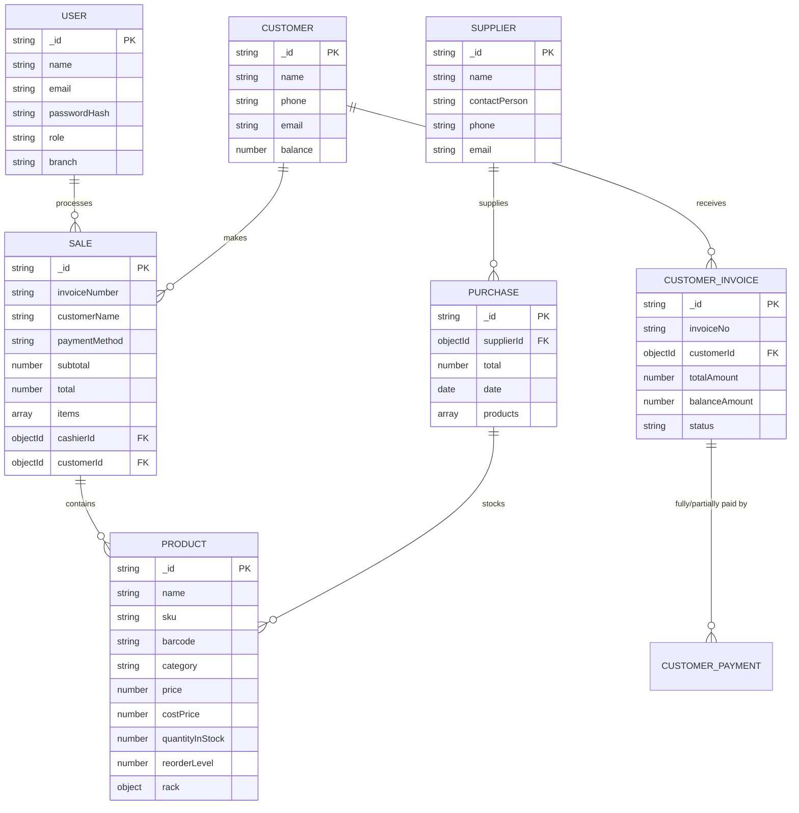

# Database Schema Blueprint (ERD)

## 1. Entity Relationship Diagram (ERD)
The system uses **MongoDB**, so these represent the logical collections and their reference-based relationships.

## 2. Collection Schema Details

### Users (`User`)
- Management of staff and permissions.
- Roles: `admin`, `cashier`.

### Products (`Product`)
- Central stock management.
- Tracking SKUs, Barcodes, and location (`rack`).

### Sales (`Sale`)
- Transactional records.
- Stores snapshotted product data (price at time of sale) to maintain history.

### Customers (`Customer`) & Suppliers (`Supplier`)
- Entities for B2B and regular client management.
- Track outstanding balances and contact info.
