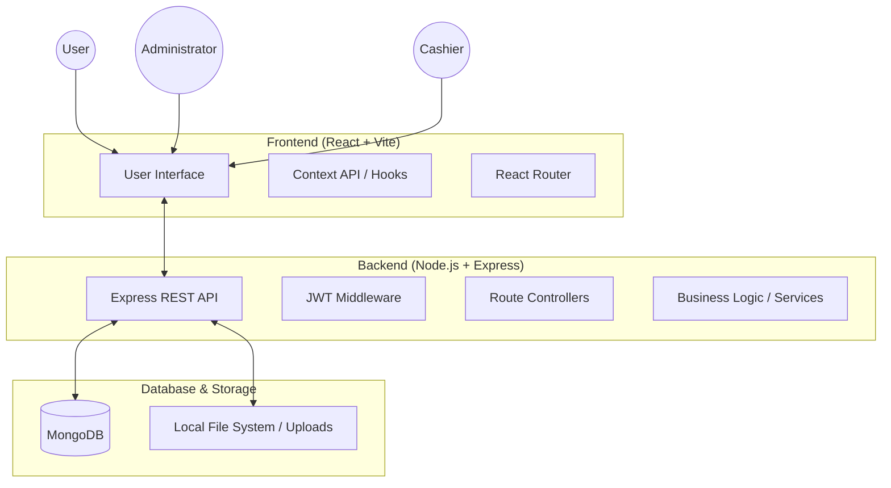
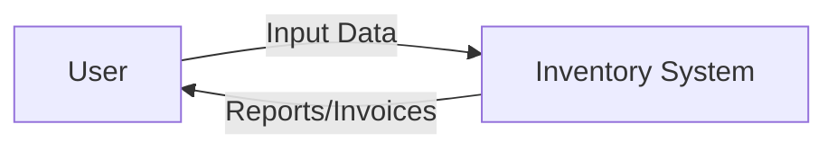
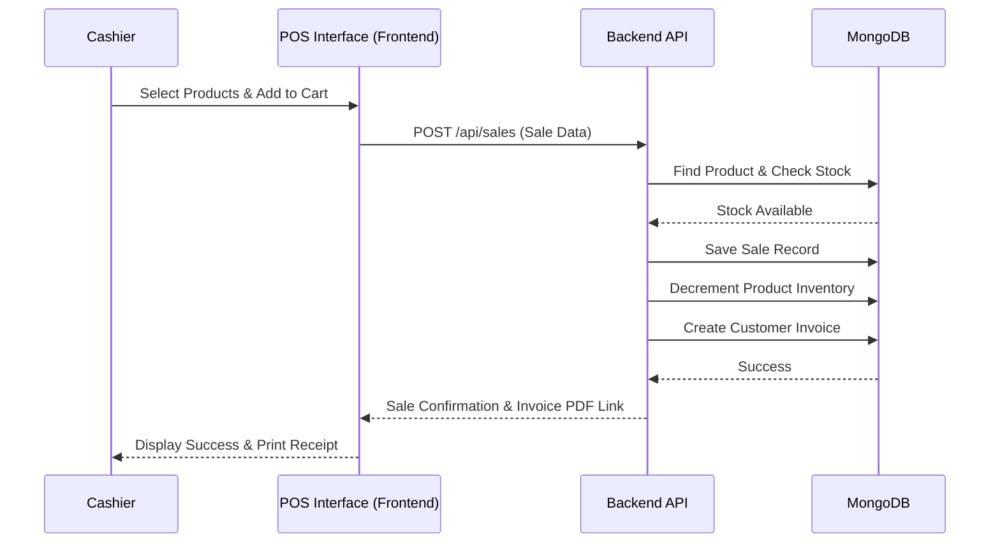

# Software Architecture Document (SAD)

## 1. High-Level System Architecture
The Inventory Management System follows a classic **Client-Server Architecture** utilizing the **MERN Stack** (MongoDB, Express.js, React, Node.js).

## 2. Component Descriptions
- **Frontend**: A single-page application (SPA) built with React and Vite. It communicates with the backend via RESTful APIs using `fetch`.
- **Backend**: A Node.js application using Express.js to handle HTTP requests, perform business logic, and interact with the database.
- **Database**: MongoDB serves as the primary data store for products, sales, users, etc.
- **Authentication**: JWT (JSON Web Tokens) are used to secure endpoints and manage user sessions.

## 3. Data Flow Diagrams (DFD)

### Level 0: Global Data Flow

### Level 1: Sale Processing Flow

